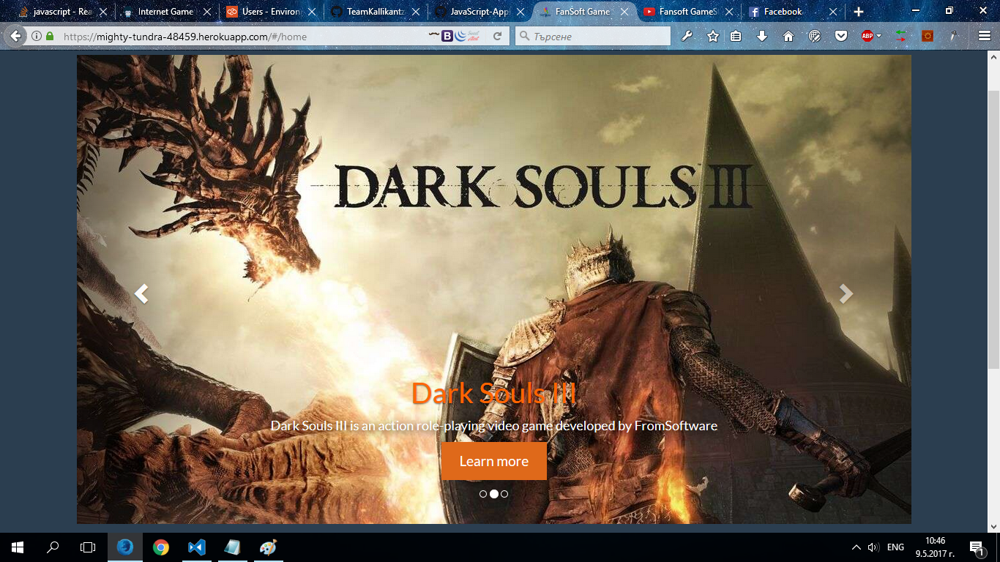
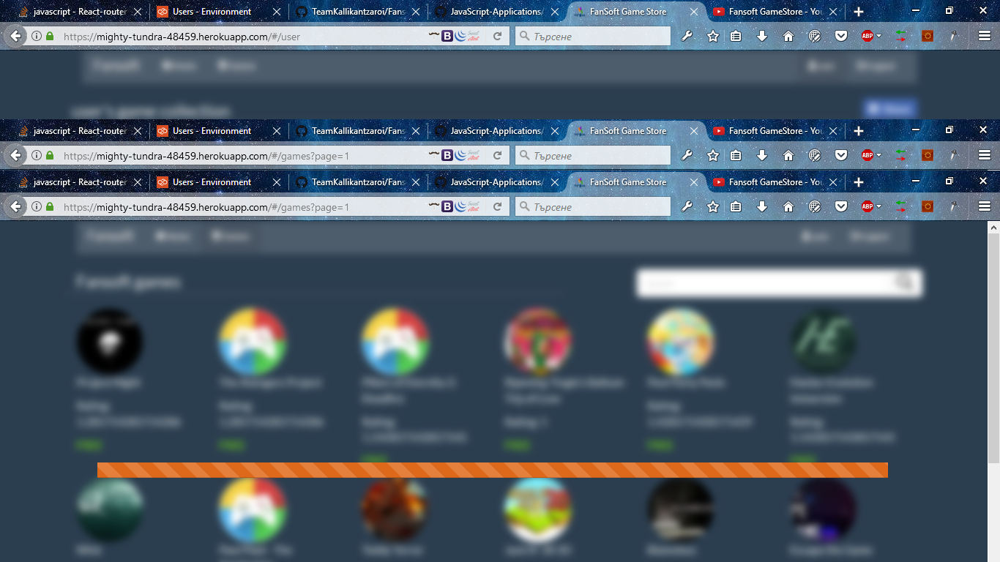
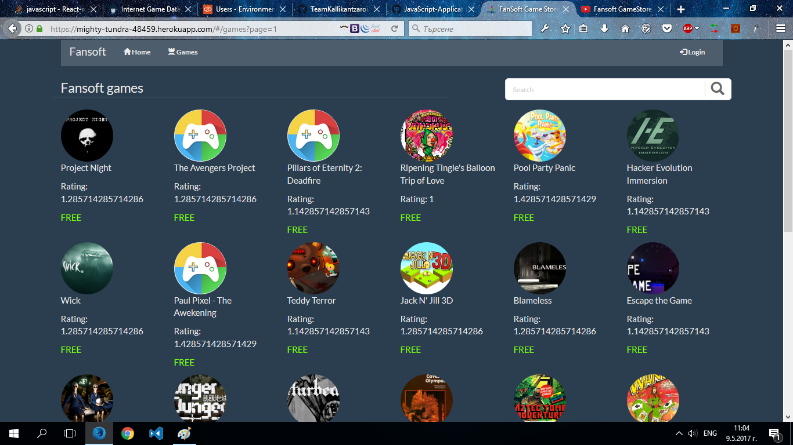
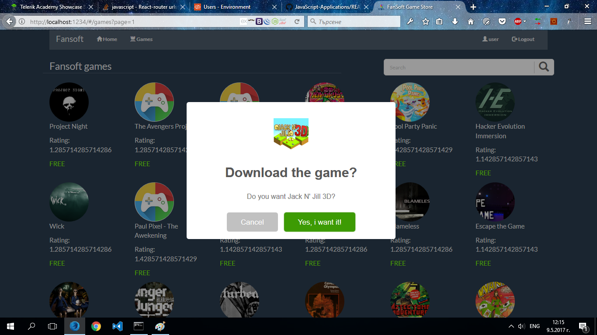
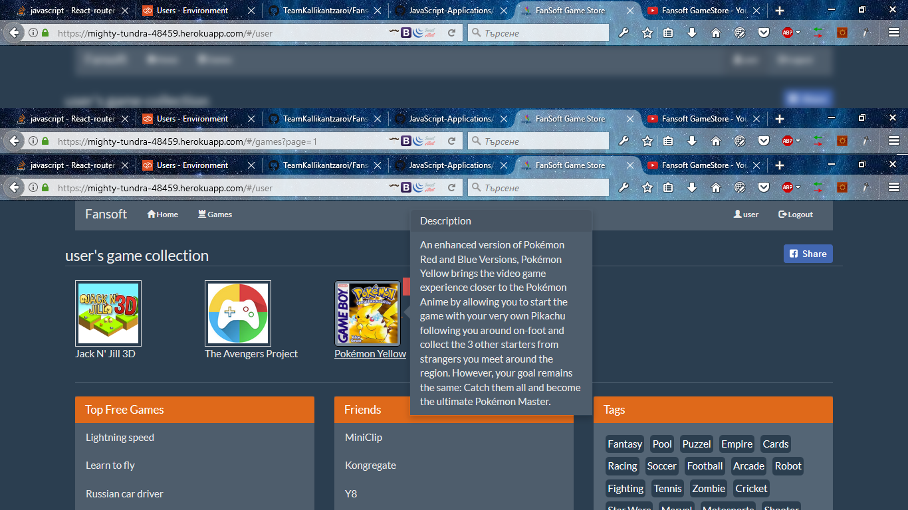

# Fansoft GameStore
**A teamwork project developed by team "Kallikantzaroi" for the JS Apps course of the Telerik Academy Season 8.**

## Project Description
You haven't heard of it?! Fansoft is the new kid on the block! Not just an ordinary sigle page application, but a 
technical work of a thousand marketing geniuses with no-sleep habits! Welcome to the №1 contender for the title
salescompany of the year with it's new and fresh games every day and amazing user experience!
 
## Installation
1. Download or clone the project
1. npm install
1. npm start
1. http://localhost:1234/

       *or simply*

 https://mighty-tundra-48459.herokuapp.com

## Application Demo
- [**Live Preview**](https://github.com/TeamKallikantzaroi/FansoftGameStore)
- [**Video Preview**](https://www.youtube.com/watch?v=wiHO-IkqduQ)
- [**Telerik Academy Showcase System**]()

## Screenshots
- 
- 
- 
- 
- 

# Credits
| Team member         | Username     |
| -------------       | :--------:   |
| Rosen Urkov         | [**rosen.urkov**](http://telerikacademy.com/Users/rosen.urkov)  |
| Daniel Georgiev     | [**bgdopus**](http://telerikacademy.com/Users/bgdopus)  |

License
-------

Free license. This is open source project.
